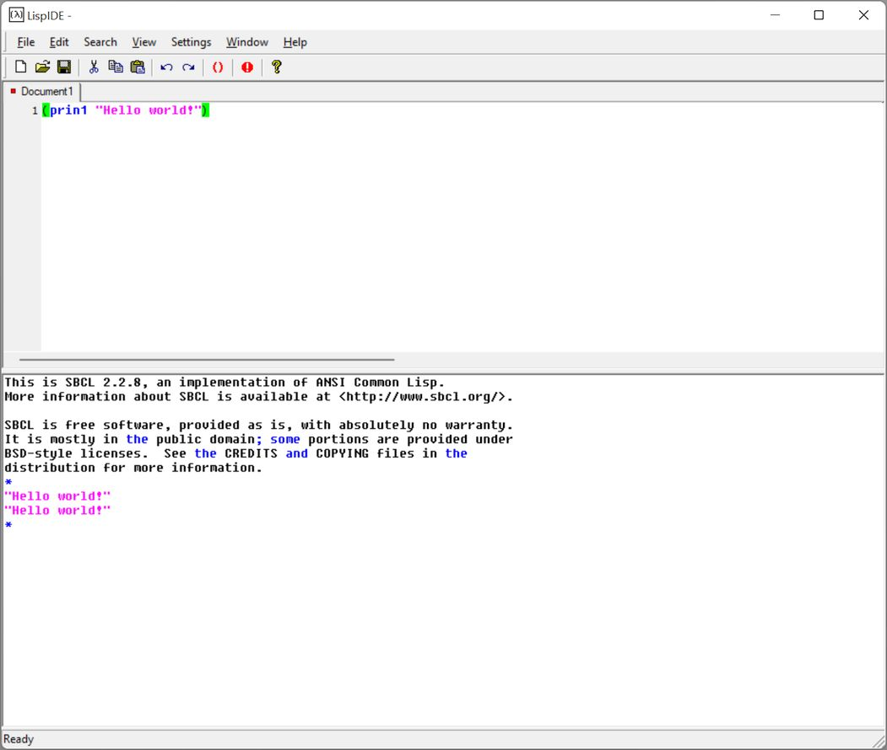

LispIDE
=======

Generic Lisp Editor For Windows
-------------------------------

Copyright 2022 DaanSystems.com http://www.daansystems.com

LispIDE provides a graphical shell around
several Lisp implementations for Windows.

Download Latest Version (64 bit)
-----------------------
[LispIDE_Setup.exe v20220904.10](https://github.com/daansystems/lispide/raw/master/installer/LispIDE_Setup.exe)

LispIDE seems to work with
--------------------------
- [CLISP](https://clisp.sourceforge.io/)
- [Steel Bank Common Lisp](https://www.sbcl.org/)
- [Corman Lisp](https://github.com/sharplispers/cormanlisp)
- [GCL - GNU Common Lisp](https://www.gnu.org/software/gcl/)
- [Bigloo Scheme](https://www-sop.inria.fr/mimosa/fp/Bigloo/)
- [Gambit Scheme](https://gambitscheme.org/)
- [SCM Scheme](http://people.csail.mit.edu/jaffer/SCM)
- [Chicken Scheme](https://wiki.call-cc.org/)
- [Arc](http://arclanguage.org/)
- [Clozure Common Lisp](https://www.clozure.com/ccl)
- [Armed Bear Common Lisp](https://armedbear.common-lisp.dev/)
- [newLISP](http://www.newlisp.org/)
- [OpenLisp](http://www.openlisp.org/)
- [PicoLisp](https://picolisp.com/wiki/?home)
- [Clojure](https://clojure.org/)
- [ISLisp](http://www.islisp.org/)
- [Janet Language](https://janet-lang.org/)

If you want commandline parameters for your Lisp
you need to create a .bat or .cmd file and
select that as your Lisp executable.

-------------------------------------
LispIDE is freeware.
-------------------------------------

LispIDE was written in C++ (!) and uses
the following stuff:

- [Windows Template Library](https://wtl.sourceforge.io/)
- [Scintilla](https://www.scintilla.org/) and [Lexilla](https://www.scintilla.org/Lexilla.html)
- [CScintillaCtrl](http://www.naughter.com/scintilla.html)
- [CAppSettings](https://www.codeproject.com/Articles/630/User-settings-class-for-ATL-WTL-projects)
- [Lisp Logo](http://www.lisperati.com/logo.html)
- Common Lisp HyperSpec by The Harlequin Group Limited.
- Common Lisp the Language, 2nd Edition by Guy L. Steele, Thinking Machines, Inc.

-------------------------------------

Changes:

- v20220906.08
  + Add tabsize 2
  + Fix closing a document with Ctrl+F4
  + Fix font for brace highlighting

- v20220904.10
  + Updated to Scintilla v530 and Lexilla v5.1.9
  + Updated to WTL10
  + Updated to VS2022
  + Update to CScintillaCtrl v1.72
  + Add 64bit build project
  + Added support for Janet language
  + Signed Installer
  + Added file extension support for various Lisps

- v20100318.07

  + Added Clojure support.
  + Updated to Scintilla 2.03

- v20100219.14

  + Added PicoLisp support.

- v20100202.21

  + And again more fixes for closing a tree of spawned child processes.

- v20100202.16

  + More fixing for closing a tree of spawned child processes.
  + Added some missing newLISP keywords.
  + Updated to Scintilla 2.02

- v20100128.21

  + Fixed reset for process trees again.

- v20100128.14

  + Fixed terminating of batch file started LISPs when using reset button.
  + Fixed undo buffer on new loaded files.
  + Fixed "tab uses spaces" not checked in menu.
  + Added tabsize setting.

- v20100114.11

  + Added sorting of document list in the window menu.

- v20091221.11

  + Added ISLISP (OpenLisp) support.

- v20091117.18

  + Fixed another copy & paste problem in the REPL.

- v20091112.15

  + It's no longer possible to select LispIDE as your
    Lisp program to prevent infinite loops.
  + Fixed pasting expressions in the REPL.
  + Added modified indication images to the tabs.
  + Added Installer.

- v20091006.19

  + Added newLISP support.
  + Added Drag & Drop support.
  + Updated to Scintilla 2.01
  + Updated platform SDK.

- v20090808.09

  + Tabs are now on multiple rows.

- v20090805.21

  + Updated to WTL8.1.
  + Update to Scintilla 1.79.
  + Fixed Ctrl combinations after selection in REPL window.

- v20090301.20
  + Fixed a crash when clearing all in the REPL.

- v20090228.18
  + Added Scheme language for syntax coloring.
  + Fixed some cursor positioning problems in the REPL.

- v20090128.16
  + Fixed "close all" leaving some documents open.
  + Using own document history for re-opening on restart.
  + Fixed lineendings problems and selectable in menu (thanks to Jameel Al-Aziz).
  + Added sources as darcs repository

- v20081013.16
  + Added full path of the active file in the title bar.
  + Set word wrap mode for REPL.
  + Added macroexpand-1 to "send to lisp" (Ctrl+Enter).

- v20080930.21
  + Added Common Lisp HyperSpec and Common Lisp the Language, 2nd edition
    as help files.

- v20080924.17
  + Fixed several crashes.

- v20080810.22
  + Fixed possible crash on closing.

- v20080806.13
  + Fixed crash on startup.

- v20080805.13
  + Removed linenumbers from REPL.

- v20080805.12
  + Add "Tab uses spaces" setting.

- v20080805.10
  + Show error when save fails.

- v20080804.23
  + Fixed saving of files in wrong dir.

- v20080804.15
  + REPL is now Scintilla too.

- v20080804.10
  + Max length in REPL is now 1024*1024 characters
  + Fixed some command history problems.

- v20080803.20 Initial release.
